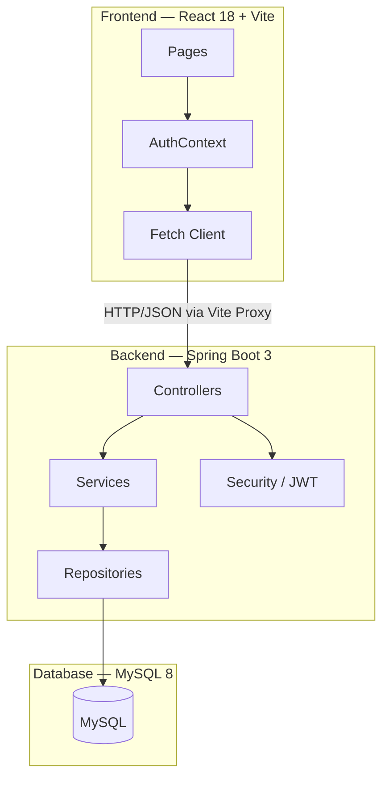
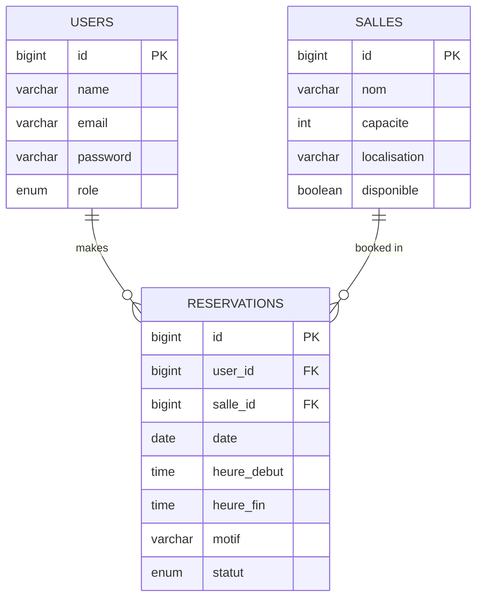
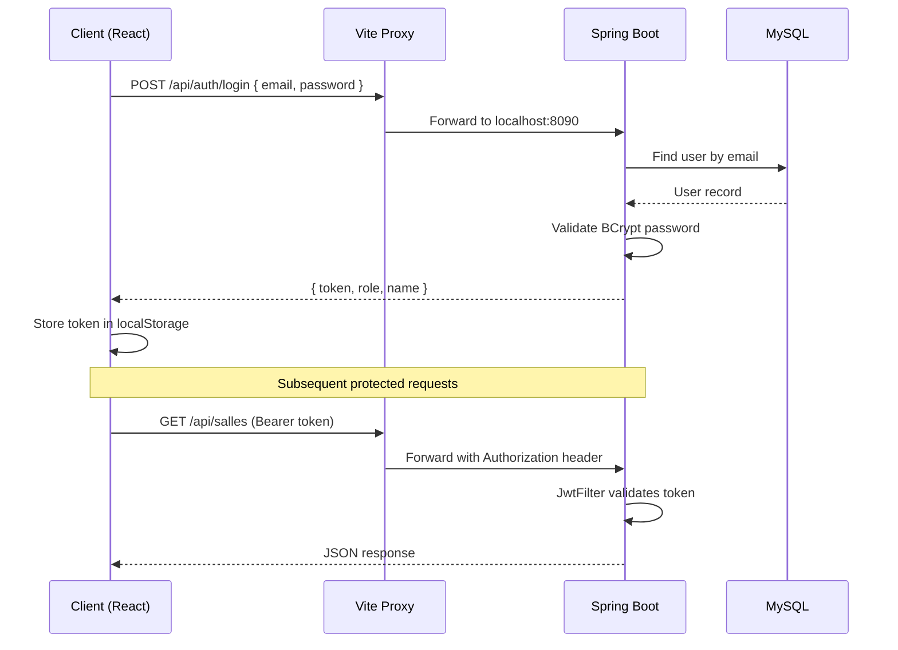

# Campus Room Booking

> Système de gestion des réservations des salles de rattrapage
> Université Cadi Ayyad — Faculté des Sciences Semlalia — ISI S6 — 2025/2026

---

## Table of Contents

- [Overview](#overview)
- [Architecture](#architecture)
- [Tech Stack](#tech-stack)
- [Project Structure](#project-structure)
- [Database Schema](#database-schema)
- [API Endpoints](#api-endpoints)
- [Authentication Flow](#authentication-flow)
- [Getting Started](#getting-started)
- [Authors](#authors)

---

## Overview

A full-stack web application for managing makeup class room reservations at FSSM, Cadi Ayyad University. Teachers can book rooms for catch-up sessions, and administrators manage the rooms, users, and all reservations.

**Key features:**

- Secure JWT-based authentication with role-based access control
- Full CRUD management for rooms and reservations
- Automatic conflict detection to prevent double-booking
- Responsive React frontend with protected routes
- RESTful Spring Boot backend with MySQL persistence

---

## Architecture



---

## Tech Stack

### Backend

| Technology | Purpose | Version |
|---|---|---|
| Spring Boot | REST API framework | 3.x |
| Spring Security | Authentication and authorization | 7.x |
| JJWT | JWT token generation and validation | 0.12.3 |
| Spring Data JPA | ORM / database access layer | 7.x |
| Hibernate | JPA implementation | 7.x |
| MySQL | Relational database | 8.0 |
| Maven | Build tool | 3.x |
| Lombok | Boilerplate reduction | 1.18.x |

### Frontend

| Technology | Purpose | Version |
|---|---|---|
| React | UI library | 18.3 |
| Vite | Build tool and dev server | 5.4 |
| Tailwind CSS | Utility-first styling | 3.4 |
| React Router | Client-side routing | 6.26 |
| Fetch API | HTTP client (native) | — |

---

## Project Structure

```
campus-room-booking/
│
├── backend/
│   ├── src/main/java/com/room/backend/
│   │   ├── auth/
│   │   │   ├── User.java
│   │   │   ├── Role.java
│   │   │   ├── UserRepository.java
│   │   │   ├── AuthService.java
│   │   │   ├── AuthController.java
│   │   │   └── dto/
│   │   │       ├── LoginRequest.java
│   │   │       ├── RegisterRequest.java
│   │   │       └── AuthResponse.java
│   │   ├── salle/
│   │   │   ├── Salle.java
│   │   │   ├── SalleRepository.java
│   │   │   ├── SalleService.java
│   │   │   ├── SalleController.java
│   │   │   └── dto/
│   │   │       ├── SalleRequest.java
│   │   │       └── SalleResponse.java
│   │   ├── reservation/
│   │   │   ├── Reservation.java
│   │   │   ├── ReservationRepository.java
│   │   │   ├── ReservationService.java
│   │   │   ├── ReservationController.java
│   │   │   └── dto/
│   │   │       ├── ReservationRequest.java
│   │   │       └── ReservationResponse.java
│   │   └── security/
│   │       ├── JwtUtil.java
│   │       ├── JwtFilter.java
│   │       ├── UserDetailsServiceImpl.java
│   │       └── SecurityConfig.java
│   ├── src/main/resources/
│   │   └── application.properties
│   └── pom.xml
│
├── frontend/
│   ├── src/
│   │   ├── api/
│   │   │   └── client.js
│   │   ├── context/
│   │   │   └── AuthContext.jsx
│   │   ├── components/
│   │   │   ├── ProtectedRoute.jsx
│   │   │   └── Navbar.jsx
│   │   ├── pages/
│   │   │   ├── Login.jsx
│   │   │   ├── Register.jsx
│   │   │   ├── Dashboard.jsx
│   │   │   ├── Salles.jsx
│   │   │   └── Reservations.jsx
│   │   ├── App.jsx
│   │   └── main.jsx
│   ├── vite.config.js
│   └── package.json
│
├── .gitignore
└── README.md
```

---

## Database Schema



---

## API Endpoints

### Authentication

| Method | Endpoint | Description | Access |
|---|---|---|---|
| POST | `/api/auth/login` | Sign in, returns JWT token | Public |
| POST | `/api/auth/register` | Create a new account | Public |

### Rooms (Salles)

| Method | Endpoint | Description | Access |
|---|---|---|---|
| GET | `/api/salles` | List all rooms | Authenticated |
| GET | `/api/salles/{id}` | Get room by ID | Authenticated |
| GET | `/api/salles/disponibles` | List available rooms | Authenticated |
| POST | `/api/salles` | Create a room | Admin only |
| PUT | `/api/salles/{id}` | Update a room | Admin only |
| DELETE | `/api/salles/{id}` | Delete a room | Admin only |

### Reservations

| Method | Endpoint | Description | Access |
|---|---|---|---|
| GET | `/api/reservations` | List all reservations | Admin only |
| GET | `/api/reservations/me` | My reservations | Enseignant |
| GET | `/api/reservations/{id}` | Get reservation by ID | Owner / Admin |
| POST | `/api/reservations` | Create a reservation | Enseignant |
| PUT | `/api/reservations/{id}` | Update a reservation | Owner / Admin |
| DELETE | `/api/reservations/{id}` | Delete a reservation | Owner / Admin |

---

## Authentication Flow



---

## Getting Started

### Prerequisites

- Java 17 or higher
- Node.js 18 or higher
- MySQL 8.0
- Maven 3.x

### Database Setup

```sql
CREATE DATABASE campus_room_booking;
```

### Backend Setup

```bash
cd backend
```

Configure `src/main/resources/application.properties`:

```properties
spring.datasource.url=jdbc:mysql://localhost:3306/campus_room_booking
spring.datasource.username=root
spring.datasource.password=yourpassword

spring.jpa.hibernate.ddl-auto=update
spring.jpa.show-sql=true

jwt.secret=your_secret_key_minimum_32_characters
jwt.expiration=86400000

server.port=8090
```

Run the backend:

```bash
./mvnw spring-boot:run
```

Backend runs on `http://localhost:8090`

### Frontend Setup

```bash
cd frontend
npm install
npm run dev
```

Frontend runs on `http://localhost:5173`

All `/api` requests are automatically proxied to `http://localhost:8090` via the Vite proxy — no CORS configuration required.

---

## Authors

| Name | Role |
|---|---|
| **Ilyasse Younes** | Backend + Frontend |
| **Abdelhay Zaadaddi** | Backend + Frontend |

---

*Universite Cadi Ayyad — Faculte des Sciences Semlalia — Departement Informatique — ISI S6 — 2025/2026*