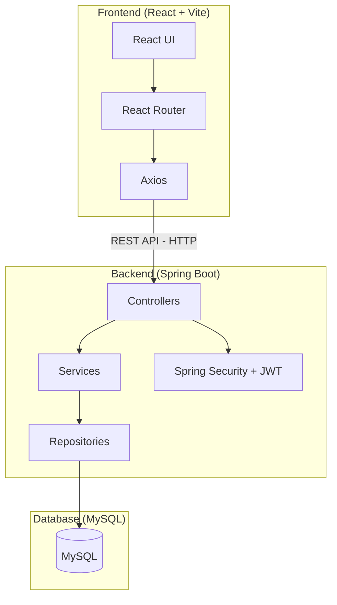
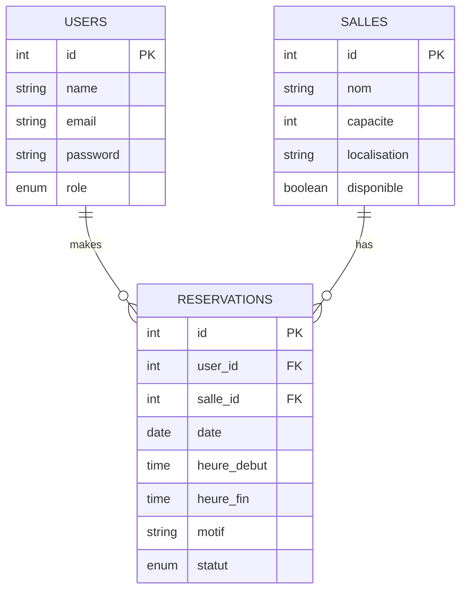
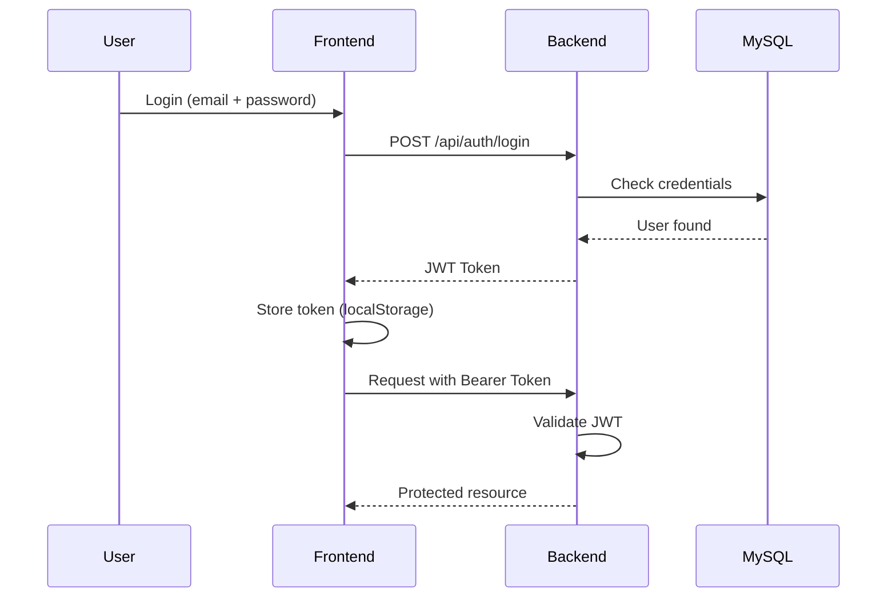

# 🏫 Campus Room Booking

A full-stack web application for managing makeup/catch-up classroom reservations at Cadi Ayyad University (FSSM).

> Built with **Spring Boot** + **React** | ISI S6 — 2025/2026

---

## 📐 Project Architecture



---

## 🗄️ Database Schema



---

## 🔄 Authentication Flow



---

## 📁 Folder Structure

```
campus-room-booking/
│
├── backend/
│   ├── src/main/java/com/yourname/backend/
│   │   ├── auth/
│   │   │   ├── User.java
│   │   │   ├── Role.java
│   │   │   ├── UserRepository.java
│   │   │   ├── AuthService.java
│   │   │   ├── AuthController.java
│   │   │   └── dto/
│   │   │       ├── LoginRequest.java
│   │   │       ├── RegisterRequest.java
│   │   │       └── AuthResponse.java
│   │   │
│   │   ├── salle/
│   │   │   ├── Salle.java
│   │   │   ├── SalleRepository.java
│   │   │   ├── SalleService.java
│   │   │   ├── SalleController.java
│   │   │   └── dto/
│   │   │       └── SalleRequest.java
│   │   │
│   │   ├── reservation/
│   │   │   ├── Reservation.java
│   │   │   ├── ReservationRepository.java
│   │   │   ├── ReservationService.java
│   │   │   ├── ReservationController.java
│   │   │   └── dto/
│   │   │       └── ReservationRequest.java
│   │   │
│   │   ├── security/
│   │   │   ├── JwtUtil.java
│   │   │   ├── JwtFilter.java
│   │   │   ├── UserDetailsServiceImpl.java
│   │   │   └── SecurityConfig.java
│   │   │
│   │   └── BackendApplication.java
│   │
│   ├── src/main/resources/
│   │   ├── application.properties
│   │   └── .env
│   └── pom.xml
│
├── frontend/
│   ├── public/
│   ├── src/
│   │   ├── api/
│   │   │   ├── auth.js
│   │   │   ├── salles.js
│   │   │   └── reservations.js
│   │   ├── components/
│   │   │   ├── Navbar.jsx
│   │   │   ├── SalleCard.jsx
│   │   │   └── ReservationTable.jsx
│   │   ├── context/
│   │   │   └── AuthContext.jsx
│   │   ├── pages/
│   │   │   ├── Login.jsx
│   │   │   ├── Dashboard.jsx
│   │   │   ├── Salles.jsx
│   │   │   └── Reservations.jsx
│   │   ├── App.jsx
│   │   └── main.jsx
│   ├── package.json
│   └── vite.config.js
│
├── .gitignore
└── README.md
```

---

### Branch Strategy

| Branch | Purpose |
|--------|---------|
| `main` | Stable, production-ready code |
| `feature/auth` | Authentication (JWT, login, roles) |
| `feature/salles` | Room management CRUD |
| `feature/reservations` | Reservation management + conflict detection |

---

## 🔌 API Endpoints

### Auth
| Method | Endpoint | Description | Role |
|--------|----------|-------------|------|
| POST | `/api/auth/login` | Login and get JWT token | Public |
| POST | `/api/auth/register` | Register new user | Admin |

### Salles (Rooms)
| Method | Endpoint | Description | Role |
|--------|----------|-------------|------|
| GET | `/api/salles` | Get all rooms | All |
| GET | `/api/salles/{id}` | Get room by ID | All |
| POST | `/api/salles` | Create a room | Admin |
| PUT | `/api/salles/{id}` | Update a room | Admin |
| DELETE | `/api/salles/{id}` | Delete a room | Admin |
| GET | `/api/salles/disponibles?date=&debut=&fin=` | Get available rooms by time slot | All |

### Reservations
| Method | Endpoint | Description | Role |
|--------|----------|-------------|------|
| GET | `/api/reservations` | Get all reservations | Admin |
| GET | `/api/reservations/{id}` | Get reservation by ID | Admin/Owner |
| GET | `/api/reservations/me` | Get my reservations | Enseignant |
| POST | `/api/reservations` | Create a reservation | Enseignant |
| PUT | `/api/reservations/{id}` | Update a reservation | Admin/Owner |
| DELETE | `/api/reservations/{id}` | Delete a reservation | Admin/Owner |

---

## ⚙️ Tech Stack

| Layer | Technology |
|-------|-----------|
| Frontend | React 18 + Vite |
| Styling | Tailwind CSS |
| HTTP Client | Axios |
| Routing | React Router v6 |
| Backend | Spring Boot 3 |
| Security | Spring Security + JWT |
| ORM | Spring Data JPA / Hibernate |
| Database | MySQL 8 |
| Build Tool | Maven |

---

## 🚀 Getting Started

### Prerequisites
- Java 17+
- Node.js 18+
- MySQL 8

### Backend Setup
```bash
cd backend
# Configure application.properties with your MySQL credentials
./mvnw spring-boot:run
# Runs on http://localhost:8080
```

### Frontend Setup
```bash
cd frontend
npm install
npm run dev
# Runs on http://localhost:5173
```

### Database Setup
```sql
CREATE DATABASE campus_room_booking;
```

```properties
# application.properties
spring.datasource.url=jdbc:mysql://localhost:3306/campus_room_booking
spring.datasource.username=root
spring.datasource.password=yourpassword
spring.jpa.hibernate.ddl-auto=update
spring.jpa.show-sql=true
```

---